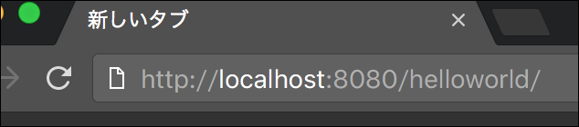
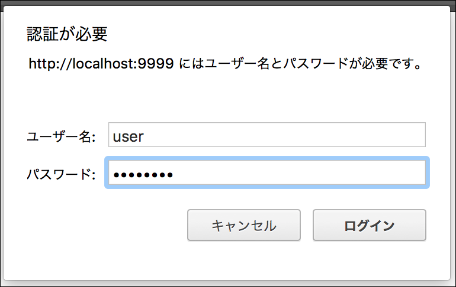
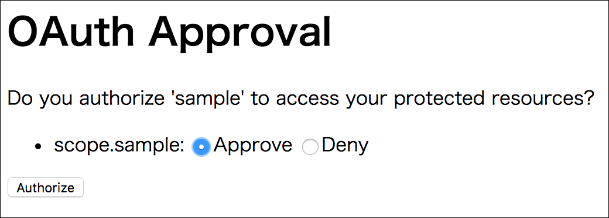

これは[Java EE Advent Calendar 2016](http://qiita.com/advent-calendar/2016/javaee)の17日目です。

## 概要

JAX-RSの参照実装であるJerseyにはOAuth 2のクライアントをサポートする拡張があります。
今回はそれを使ったサンプルを作ってみました。
ちなみに、認証サーバはSpringで作ってみました。

サンプルコードはGitHubに公開しています。

* https://github.com/backpaper0/javaeeac2016 （この記事の解説に対応しているのは[qiita](https://github.com/backpaper0/javaeeac2016/tree/qiita)ブランチです）

## サンプルの説明

アプリケーション自体は"Hello, <ユーザ名>!"を表示するだけの簡単なものです。
このユーザ名に当たる部分を、認証サーバで認証したユーザの名前を取得して表示します。
ユーザ情報の取得に対する許可をOAuth 2で与えています。

まず http://localhost:8080/helloworld を開こうとします。



すると、認証サーバへリダイレクトされ、ログインを促されます。



ログインすると、今度はhelloworldアプリケーションに対してユーザ情報の取得に対する許可を与えるか確認されます。



許可を与えると、helloworldアプリケーションに戻ってきて挨拶が表示されます。


## コードの説明

セッションにアクセストークンが保存されていない場合、helloworldアプリケーションが認可されていないと判断して、アクセストークンを取得するための認可コードを取得するため、[`OAuth2CodeGrantFlow`の`start`メソッドを使用してリダイレクトURIを構築しています](https://github.com/backpaper0/javaeeac2016/blob/qiita/helloworld/src/main/java/com/example/UaaFilter.java#L74-L80)。

```java
OAuth2CodeGrantFlow flow = OAuth2ClientSupport.authorizationCodeGrantFlowBuilder(
        clientIdentifier, authorizationUri, accessTokenUri)
        .redirectUri(redirectUri)
        .client(client)
        .property(Phase.ALL, OAuth2Parameters.STATE, state.getValue())
        .build();
URI location = URI.create(flow.start());
```

認可が済むと、上記の`redirectUri`メソッドで設定したURIにリダイレクトされますが、このとき認可コードが`code`という名前でクエリパラメータとして付いてきます。
リクエストURIをパーズして`code`を得たら、[`OAuth2CodeGrantFlow`の`finish`メソッドに渡してアクセストークンを取得します](https://github.com/backpaper0/javaeeac2016/blob/qiita/helloworld/src/main/java/com/example/UaaFilter.java#L61-L68)。

```java
OAuth2CodeGrantFlow flow = OAuth2ClientSupport.authorizationCodeGrantFlowBuilder(
        clientIdentifier, authorizationUri, accessTokenUri)
        .redirectUri(redirectUri)
        .client(client)
        .property(Phase.ALL, OAuth2Parameters.STATE, state.getValue())
        .build();
String state = queryParameters.getFirst("state");
TokenResult tokenResult = flow.finish(code, state);
```

ユーザー情報を取得する際は、アクセストークンを`Authorization`ヘッダに埋め込みますが、これを勝手にやってくれる`Feature`を生成するのが[`OAuth2ClientSupport`の`feature`メソッドです](https://github.com/backpaper0/javaeeac2016/blob/qiita/helloworld/src/main/java/com/example/OAuth2ClientFactory.java#L30)。
この`Feature`を`Client`に登録しておきます。

```java
public Client client() {
    return ClientBuilder.newBuilder()
            .register(HttpAuthenticationFeature.basic(clientId, clientSecret))
            .register(OAuth2ClientSupport.feature(accessToken.getValue()))
            .build();
}
```

## まとめ

Jerseyの`oauth2-client`を使えば、OAuth 2を利用したクライアントアプリケーションを作ることができました。
とはいえ、サンプルコードを見てもらうと分かるように、それなりに作りこむ必要がありました（私の`oauth2-client`習熟不足かもしれませんが）。
さらに、とりあえず動く形にしてみたぐらいなので、実装する上でもっと考慮しないといけないことはあると思います。

このように、もうちょい簡単に作れたらいいのになー、と贅沢な不満はありますが、動くサンプルは作れたので満足しました。

以上⛄️
